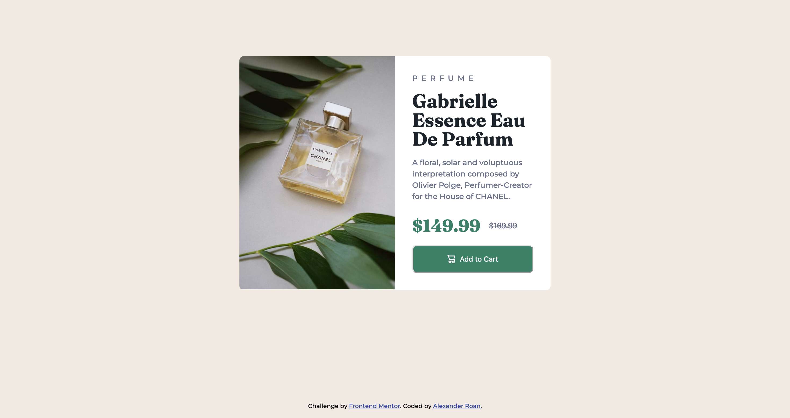
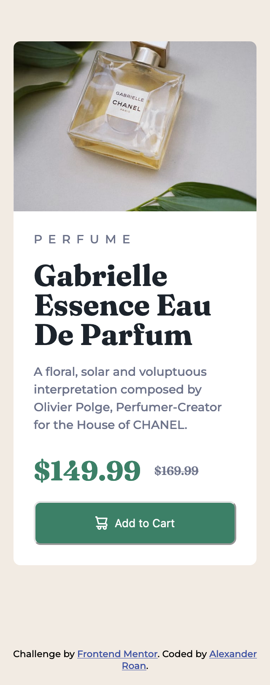

# Frontend Mentor - Product preview card component solution

This is a solution to the [Product preview card component challenge on Frontend Mentor](https://www.frontendmentor.io/challenges/product-preview-card-component-GO7UmttRfa). Frontend Mentor challenges help you improve your coding skills by building realistic projects.

## Table of contents

- [Overview](#overview)
  - [The challenge](#the-challenge)
  - [Screenshot](#screenshot)
  - [Links](#links)
- [My process](#my-process)
  - [Built with](#built-with)
  - [What I learned](#what-i-learned)
  - [Continued development](#continued-development)
  - [Useful resources](#useful-resources)
- [Author](#author)
- [Acknowledgments](#acknowledgments)

**Note: Delete this note and update the table of contents based on what sections you keep.**

## Overview

### The challenge

Users should be able to:

- View the optimal layout depending on their device's screen size
- See hover and focus states for interactive elements

### Screenshot

### Links

- Solution URL: [Solution](https://github.com/dearestalexander/fm_prod-prev-card)
- Live Site URL: [Github Pages](https://dearestalexander.github.io/fm_prod-prev-card/)

## My process

Planned process:

1. Set up git local repository, and github repository and make initial commit and push
2. Review README and style-guide
3. Decide on approach:
    - Start with mobile first designing for 320px width screens
    - Looking at the design and note anything that may impact html structure
      - Mobile & desktop design suggests display: flex will work well to switch the image & text from column to row alignment
      - (will need to test whether to use flex-wrap or a media-query for the transition)
      - I will need to decide on how to handle switching the image. I guess this might need a media query.
    - Create the HTML structure based on mobile design, check / adjust anything for desktop
    - Start to build out the CSS
      - I don't see anything unusual in the design. I think flex can be used for alignment of all the text and buttons.
4. Let's try to build it and see what I learn!

I will add adjustments and learnings in 'what I learned'

### Built with

- Focus on mobile first
- Focus on flexbox
- Try to utilise the following well
  - CSS variables
  - Relative unit of measures
  - Logical properties e.g. `max-inline-size` and `padding-block`
  - Block element method naming

### What I learned

I had a hard time trying to make the mobile and desk top designs align the spec while keeping the design naturally responsive without adding a lot of adjustments to the @media queries.

For example one of the widest content elements is the product description. On the two designs the longest lines are:

- Mobile: `Polge, Perfumer-Creator for the House of` around 41 chars + padding
- Desktop: `Olivier Polge, Perfumer-Creator` around 31 chars + padding

My approach was

Mobile first:

1) Set the overall component width to 90% of container i.e. `max-inline-size: 90%`
2) Use flex throughout. Noteworthy the component starts on flex-column with children for images & copy container
3) Set my media query at a generous 48rem; small screen design for phones, small tablets etc.
4) To stop the content & image expanding too much adjust component width to `max-inline-size: min(41ch, 90%);`

Then moving to the desktop design within the min-width 48rem media query I have:

1) Adjust the component `max-inline-size: 90%` to remove the 41ch restriction
2) Change component flex direction to row. Set wrap to nowrap to avoid unwanted auto wrapping to column
3) Set my max widths on the copy container and image (as opposed to the overall component)
    - I felt this was more logical as I calculated the width based on copy text as 31ch
    - Hide the mobile image, show the desktop image.

With this approach the overall design works, but the content width of the text is slightly off vs. the specs. I started to adjust padding between the main design and media query, but I feel like hard coding many settings moves away from the point of a responsive design.

I also tried to make this design without any media queries. It's possible with flexbox and content widths to auto wrap/unwrap between desktop and mobile sizes. However it seems media query is the only way to unhide one image and hide the other. If you rely on auto wrap/unwrap and a media query it's a bit tricky to time them to transition at exactly the same time. It is possible to calculate it out. But I felt again, this is is a bit 'hardcoded' and if you are going to have a transition of the image it's better to put the flex direction change in the same query and have it all controlled via the same mechanism.

### Continued development

I will probably subscribe and check the figma specs to see if there was a better indication of desired widths between mobile and desktop.

### Useful resources

I found the provided reference in the introduction to the exercise very useful. Expanded my knowledge on responsive approaches. I spent quite a bit of time testing out how ch units work in reality. I discovered if you apply them on an element with a font-size they will utilise browser default 16px and the font-specific char '0' width. If you want ch to be responsive you should apply a font size to the same element you apply the ch measure too.

## Author

- Website - [Alexander Roan](https://www.alexroan.com)
- Frontend Mentor - [@dearestalexander](https://www.frontendmentor.io/profile/dearestalexander)
- Twitter - [@xander_roan](https://x.com/xander_roan)

## Acknowledgments

Thanks to everyone at FrontendMentor.
